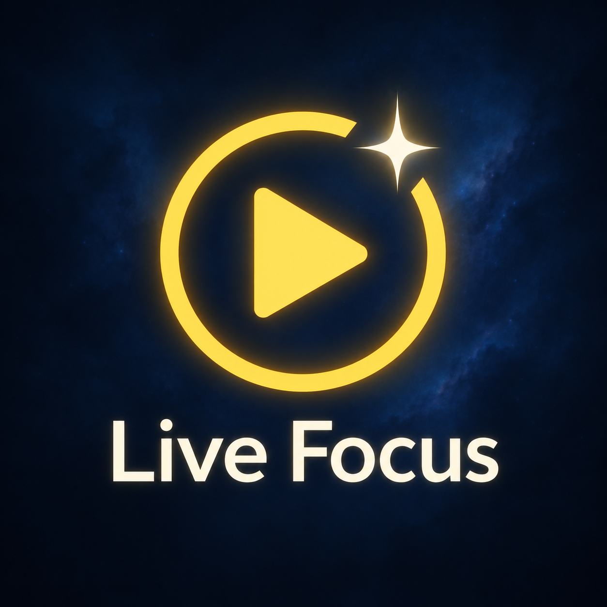
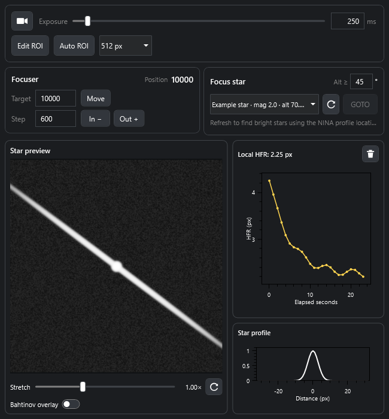

# Live Focus for N.I.N.A.



A NINA plugin for moving the focuser while watching a live star image.



Compact controls rendered with synthetic test data. Live frames use NINA's main **Image** panel by default; there is no duplicate image workspace in Live Focus. Exposure, In / Out steps, position, local HFR and stretch stay visible. **Setup** starts folded and contains ROI, target movement, absolute position and Bahtinov overlay controls. Only its contents scroll, leaving live controls accessible on short docks.

Live HFR uses NINA's existing **HFR History** panel automatically during a live run. There is no separate HFR graph in Live Focus or below the Image panel. Open HFR History in NINA's Imaging workspace and dock it where you prefer. The trace is labeled **Live Focus HFR (ROI)**: it measures the selected star's central 256-pixel window, rather than the multi-star statistics of a normal captured image. Stopping live focus restores the original captured-image graph, axes and preferences. Native Clear clears only live samples during a run; normal captured-image CSV export is available again after stopping. Saved-image history and autofocus baselines are never populated with live frames. **Profile** is an optional star intensity plot available with the local preview when **Setup → Use NINA Image** is off.

HFR history shows a fixed **120 seconds**, with the latest frame at the right edge (**0**) and older samples to its left. Display updates are capped at 5 per second so faster cameras do not shorten the history. Brief star-detection loss leaves a break in the line. Instantaneous HFR still uses every processed frame; this graph sampling does not change the measurements. Clear and starting a new live run reset the live history. [Native HFR History panel, rendered with synthetic data](docs/live-focus-native-hfr-history.png).

ROI editing uses the main Image panel when it is visible; **Retake / Done** remain in the compact Live Focus controls. A temporary local editor is available when the main viewer is closed or **Use NINA Image** is off. Finishing restores your local star-profile choice.

[Small-screen controls (350 × 180)](docs/live-focus-compact.png)

## Features

- Absolute focuser position, adjustable In / Out steps and cancellation.
- Bright-star selection from NINA's catalogue, with adjustable minimum altitude and maximum magnitude, plus profile horizon clearance. Every matching star is listed; there is no 20-star cap.
- A shared **Stars / Deep sky / Solar system** target picker with asynchronous name/ID search. Deep sky uses NINA's local Sky Atlas; Moon/planet coordinates use NINA's native ephemeris and the profile's observer location.
- Separate **Slew** (coordinates only) and **Slew + Center** (NINA's configured plate solver) buttons. Active guiding is stopped before either move; disconnected, stopped, looping and selected guiders need no stop request. Guiding is not automatically restarted.
- A **Sync mount** toggle beside the target actions directly controls NINA's existing profile **No Sync** setting, with the value inverted. There is no separate overriding setting.
- Live ROI preview, ROI HFR in the native HFR History panel and an optional local star intensity profile. On streaming cameras, preview continues during focuser movement.
- Main **Image** output sends the live ROI, stretch and optional Bahtinov overlay to NINA, capped at 10 updates/second. Normal grayscale output shares the existing frozen bitmap; overlay output is rasterized for the host. There are no extra captures, image-history entries or file saves.
- Mouse ROI selection in the main Image panel: click a star, drag the box to move it, or drag an edge/corner to resize. Yellow grips and cursor changes distinguish the actions. The external size label stays at a fixed screen size through zoom, rotation and flip. [Main Image ROI example](docs/live-focus-main-image-roi.png).
- An explicit **Auto ROI** button; starting live preview preserves the chosen ROI.
- ROI presets include **50%, 67%, 100% (Full)** of both sensor dimensions alongside 256/512/1024-pixel squares. Percentages preserve the sensor aspect ratio and selected star anchor; 50% uses roughly 25% of the pixels, 67% roughly 45%, and 100% the largest camera-aligned full frame. The percentage is relative to the camera sensor, independent of viewer size or zoom. Edges are clamped to the sensor; drag the box to move it or choose a custom size.
- Exposure slider in 50 ms increments, optional Bahtinov mask overlay in Setup and a compact stretch slider beside the live controls. Stretch changes only the display, never raw measurements.
- Optional diagnostic FITS/JSON recording and detailed timing logs. Recording is **off by default**; normal errors and warnings are still logged.

Autofocus, curve fitting, spike autofocus, sequencer instructions and lens configuration are outside this plugin's scope. Use NINA's autofocus or the original Manual Focuser plugin for those features. The Bahtinov overlay is a manual focusing aid.

## Requirements and camera support

- Windows x64, NINA **3.2.0.9001 or newer**, and the .NET 8 Windows desktop runtime used by NINA.
- Connected focuser for motor controls; connected telescope for Slew. Slew + Center additionally requires a connected camera and configured plate solver.
- QHY, ToupTek and ZWO ASI native drivers, plus cameras reporting NINA live-view capability, use the host's streaming interface. ASCOM drivers that lack live view use successive single exposures.
- QHY600M's **3x3 bin mode** falls back to single exposures; other readout modes are allowed. Camera-specific ROI alignment is applied automatically.

Streaming uses NINA's existing camera connection, with no extra SDK handles. Stop waits for the camera reader and any motor movement before releasing the capture reservation. Some native SDK downloads cannot be interrupted immediately. Exact frame rate and available ROI sizes depend on the driver and camera.

Normal streaming retains the host's 16-bit frame and applies a display lookup table instead of expanding the entire ROI into doubles. HFR still uses the original central sensor pixels at their original scale. Bahtinov analysis and diagnostic image recording expand the ROI only when enabled. The camera connection indicator stays visible with Setup folded; hover it for the last frame's exposure, ROI/source sizes and processing-stage timings.

Exposure is not the frame period: sensor readout and USB transfer can dominate even with a short exposure. NINA's QHY live-view path uses 16-bit output and the configured snapshot readout mode. Compare those settings as well as ROI dimensions when comparing another program. [Measured QHY600M pipeline and processing benchmark](docs/live-performance-2026-10-09.md).

## Build and install

```powershell
dotnet build LiveFocus.csproj -c Release
```

Output: `bin\Release\net8.0-windows\Cwseo.NINA.LiveFocus.dll`.

To deploy the build, run:

```powershell
powershell -NoProfile -ExecutionPolicy Bypass -File .\InstallPlugin.ps1
```

The script builds Release and verifies the copied DLL hash. With NINA closed, it copies the DLL and license to:

```text
%LOCALAPPDATA%\NINA\Plugins\3.0.0\Live Focus\
```

If NINA is running, it stages the update under `%LOCALAPPDATA%\NINA\PluginStaging\3.0.0\Live Focus\`; restart NINA to apply it. Staging is also refreshed when deploying with NINA closed so an older pending update cannot overwrite the new build. Use `-SkipBuild` to deploy the existing Release output.

NINA supplies its own libraries; do not copy every dependency from the build directory into the plugin folder. Reopen NINA and add the **Live Focus** dockable panel. Its separate DLL, plugin ID and settings namespace allow coexistence with Manual Focuser.

## Using it

1. Connect the camera and focuser. Open **Setup → Go to target** to choose **Stars**, **Deep sky** or **Solar system**, search and select a target, then use **Slew** or **Slew + Center**. For stars, **Alt ≥** defaults to 45° and **Mag ≤** to 4.0. Smaller magnitude limits select brighter stars; larger limits include fainter stars. Search and filter edits update the list automatically; the refresh icon recalculates current visibility. A star must also clear the profile horizon by 5°. Remove a Bahtinov mask for plate solving. Moon/planets use **Slew**.
2. Open NINA's **Image** panel. In Setup, choose **Edit ROI**, edit the yellow box directly in Image, then use **Done** in Live Focus. Zoom, scroll, rotation and flip keep the ROI in sensor coordinates. With Image closed, use the temporary local editor. **Auto ROI** is an alternative near the target star. Enable Bahtinov overlay here when using a mask.
3. Fold Setup, open NINA's **Image** panel, set exposure and press the video icon to start. Use In / Out to adjust focus while viewing the star and local HFR. Open NINA's **HFR History** panel to see live ROI measurements automatically. Movement Stop and target-move cancellation remain available with Setup folded.
4. Adjust Stretch if the preview is too bright. Stop preview before changing exposure or ROI.

Main Image output is **on by default** and display-only: adjust stretch and read live HFR in Live Focus; NINA's raw-image statistics, processing and save tools continue to refer to normal captures. Live stream frames are never published while idle, selecting ROI or stopping. Explicit **Edit ROI / Retake** publishes the full overview for mouse editing. The overlay attaches only to the host ImageView displaying that overview and is removed on Done, switching to local preview, disposal or replacement by a normal image. It does not replace host bindings or alter the camera's normal imaging ROI. Turning off **Use NINA Image** or stopping live focus ends updates and leaves the last displayed frame in place; the next normal image replaces it.

Output uses NINA's public [IImagingMediator.SetImage](https://github.com/isbeorn/nina/blob/develop/NINA.Equipment/Interfaces/Mediator/IImagingMediator.cs) display API. The dispatcher keeps at most one pending output callback and uses the latest frame; it does not prepare or record every video frame.

**Slew** never captures, solves or syncs the mount. It can work with the camera disconnected; with a connected camera it reserves capture ownership during movement to prevent overlapping exposures. **Slew + Center** uses NINA's centering tolerance and honors the profile's **No Sync** setting. Find it under **Options → Equipment → Telescope → No Sync**, or use **Setup → Go to target → Sync mount** in Live Focus (on means No Sync is off). This changes the shared NINA profile setting and applies to other NINA centering operations too. A successful sync can improve later slews, but it does not guarantee full-sky pointing accuracy. With No Sync enabled, NINA centers using an offset without updating the mount's pointing model. See [NINA No Sync](https://nighttime-imaging.eu/docs/master/site/tabs/options/equipment/#no-sync).

Guider preparation skips idle/disconnected devices. A failed stop request is accepted only if the guider has since disconnected or is confirmed idle; an active/unknown connected state still blocks movement on failure. User cancellation and guiding restarted during the move remain distinct from an already-stopped guider. This does not infer that every pointing failure is a guiding failure: camera ownership, parked mount and plate-solving errors also have their own checks.

Streaming and diagnostics settings are in NINA's plugin options. Diagnostics, when enabled before an operation, are saved under `%LOCALAPPDATA%\NINA\LiveFocus\FocusDiagnostics`. Turning recording off stops further records; existing records remain available.

The star picker uses NINA's existing bright-star catalogue. Increasing the magnitude limit cannot add stars absent from that catalogue. Its status shows the matching/catalogue counts and applied filters, and Refresh preserves your selected star when it still matches. [Star filter layout](docs/live-focus-star-filters.png).

## Target search

**Setup → Go to target** shares one search box, target list and movement controls across three categories. Setup remains folded by default to preserve image space. [Target picker layout, rendered with synthetic data](docs/live-focus-target-search.png).

- **Stars:** search NINA's bright-star catalogue case-insensitively, with the existing altitude/magnitude and horizon filters.
- **Deep sky:** search NINA's local Sky Atlas catalogue by common name or M/NGC/IC identifier; spaces and leading zeroes in these IDs are accepted. Catalogue aliases are searched; results show a matching name, current altitude and available magnitude. Up to 100 catalogue matches are shown; refine the search when the limit is reached. Star altitude/magnitude filters do not apply.
- **Solar system:** list the Moon, Mercury, Venus, Mars, Jupiter, Saturn, Uranus and Neptune. English and Korean names are searchable. Calculate topocentric coordinates using NINA's NOVAS/JPL ephemeris, UTC converted to terrestrial time with SOFA, and the profile latitude/longitude/elevation. Recalculate after guider preparation, immediately before slewing. **Slew + Center** is disabled for these targets: stellar plate solving centers a coordinate field, not the visible lunar or planetary disk. The plugin does not change the mount's tracking rate.

Deep-sky and solar-system targets remain in the list below the horizon so they can be found; movement requires at least 5° altitude and 5° clearance above the profile horizon, checked again just before Slew. Search runs off the UI thread with a 350 ms typing delay. Changing the query/category clears the old selection immediately; cancelled/late results cannot replace the latest list. Refresh preserves the selected catalogue identity when it still matches. Category/search/selection are locked during GOTO. Catalogues and ephemerides are local; the observer location must be set correctly in the active NINA profile.

## Verification

The console harnesses use synthetic frames and fake equipment mediators; they never connect or send commands to physical equipment. Catalogue/centering harnesses require a local NINA installation and its initialized catalogue/native astrometry libraries.

```powershell
dotnet run --project Tools/FocusCenteringChecks -c Release
dotnet run --project Tools/FocusCenteringChecks -c Release -- --targets
dotnet run --project Tools/FocusCenteringChecks -c Release -- --live-move
dotnet run --project Tools/FocusCenteringChecks -c Release -- --live-move --asi
dotnet run --project Tools/FocusCenteringChecks -c Release -- --auto-roi
dotnet run --project Tools/FocusCenteringChecks -c Release -- --preview-display
dotnet run --project Tools/FocusCenteringChecks -c Release -- --focuser
dotnet run --project Tools/FocusCenteringChecks -c Release -- --preview-perf
dotnet run --project Tools/FocusStreamChecks -c Release
dotnet run --project Tools/RoiInteractionChecks -c Release
dotnet run --project Tools/FocusChecks -c Release
```

The UI harness renders the actual dockable at sizes from 350 × 500 to 950 × 700 without opening NINA, checking folding, resizing and active-operation controls. It also renders NINA's real ImageView on a hidden WPF surface, checking ROI coordinate mapping, movement/resizing, cursors, zoom, rotation, flip and cleanup. These checks verify workflow, cleanup and rendering; physical camera throughput and optical performance still need field testing.

## Origin and license

Derived from [squallseo/Nina.ManualFocuser, spike_analysis](https://github.com/squallseo/Nina.ManualFocuser/tree/spike_analysis) at commit `9e9bbddffd6181389c988c2752a74eeb19e7bd2e`, extracting focuser controls, focus-star GOTO and live preview into an independent plugin. Original copyrights and the MPL-2.0 license are retained. See [LICENSE.txt](LICENSE.txt).

Plugin ID: `ae6b70d2-e99d-4931-8d7c-3e89b6aa27b4`.
