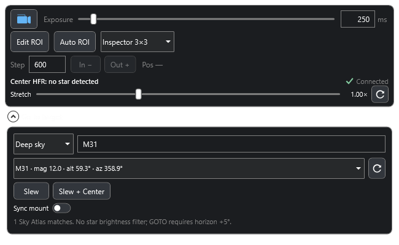

# Live Focus for N.I.N.A.

A N.I.N.A. plugin for adjusting focus while watching a live star image.

## Features

- **Live focusing:** watch the camera image while moving the focuser with adjustable **In / Out** steps, current position and stop controls.
- **Focus measurements:** read live HFR and follow its changes in N.I.N.A.'s **HFR History** panel. An optional star intensity profile is available in the local preview.
- **ROI controls:** select, move and resize a region in N.I.N.A.'s **Image** panel, use **Auto ROI**, or choose pixel-size and sensor-percentage presets.
- **Inspector 3×3:** compare star shapes at the sensor center, edges and corners in a single view.
- **Exposure and stretch:** adjust exposure and display brightness from the compact live controls.
- **Go to target:** choose bright stars with altitude and magnitude filters, search deep-sky objects by name or catalogue ID, or select the Moon and planets.
- **Slew / Slew + Center:** move to a target directly or center it with N.I.N.A.'s plate solver. Moon and planet targets use **Slew**. The **Sync mount** toggle controls N.I.N.A.'s shared profile setting.

## Requirements

- Windows x64 and N.I.N.A. **3.2.0.9001 or newer**.
- A connected camera and focuser for live focusing.
- A connected telescope for target movement; **Slew + Center** also requires a configured plate solver.
- Supported native cameras use live streaming. Cameras without live-view support use successive exposures. Available frame rates and ROI sizes depend on the camera and driver.

## License

Based on [Nina.ManualFocuser](https://github.com/squallseo/Nina.ManualFocuser/tree/spike_analysis). Original copyrights are retained. Licensed under [MPL-2.0](LICENSE.txt).
